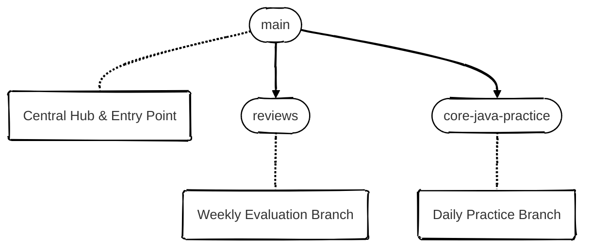
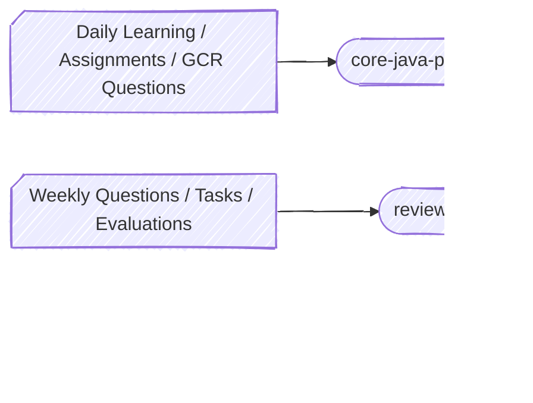

<!-- ===================================================== -->
<!--                  HERO / INTRO BANNER                  -->
<!-- ===================================================== -->

<h1>
BridgeLabz Training Repository
</h1>

<h3>
A Structured, Auditable, and Industry-Aligned Learning Workspace
</h3>

<em>Designed for disciplined practice, transparent evaluation, and professional growth</em>

<!-- ===================================================== -->
<!--                    AUTHOR PROFILE                     -->
<!-- ===================================================== -->

<h2>Prakhar Tripathi</h2>

<strong>Final Year Computer Science Student · Software Engineer</strong> 
BridgeLabz Trainee — Core Java, Problem Solving, Backend and Frontend Foundation 
 (Spring Boot + React and GenAI using Python)

---

## Executive Overview

This repository serves as a **centralized training workspace** for my BridgeLabz program.  
It is intentionally structured to reflect **industry practices** such as:

- Clear separation of concerns  
- Branch-driven development  
- Review-ready documentation  
- Traceable learning progression through commits  

The objective is not just skill acquisition, but **demonstrable engineering discipline**.

---

## Branch Strategy & Ownership Model

The repository follows a **role-based branching strategy**, where each branch has a clearly defined responsibility.

### Branch Responsibilities

| Branch | Role | Stability |
|------|-----|----------|
| `main` | Documentation & reference baseline | Stable |
| `core-java-practice` | Active development & learning | Volatile |
| `reviews` | Evaluation & performance tracking | Controlled |

---

## Branch Breakdown

### `main` — Reference & Governance Layer

**Purpose**  
Acts as the **canonical entry point** for reviewers, mentors, and auditors.

**Contains**
- Repository documentation  
- Structural overview  
- Training context and guidelines  

> This branch remains clean, stable, and presentation-ready at all times.

---

### `core-java-practice` — Execution Layer (Active)

**Purpose**  
Dedicated workspace for **hands-on coding and daily practice**.

**Contains**
- Core Java implementations  
- Concept-wise programs  
- Practice problems  
- Incremental commits reflecting real learning progression  

> This branch intentionally evolves fast and mirrors the learning curve.

---

### `reviews` — Evaluation & Feedback Layer

**Purpose**  
Supports **formal review cycles and performance monitoring**.

**Contains**
- Weekly review notes  
- Trainer feedback  
- Code review checkpoints  
- Assessment artifacts  

> Enables transparent, time-bound evaluation by BridgeLabz trainers.

---

## Repository Architecture & Workflow

This repository follows a **hub-and-spoke model**, where `main` acts as the governance hub, and all learning and evaluation activities are routed through dedicated branches.

---

## Branch Structure (Architectural View)

**Explanation**

* `main` serves as the **central control and reference branch**
* All working branches are created and managed from `main`
* No direct dependency exists between working branches

---

## Learning & Review Workflow (Operational Flow)

**Explanation**

* **Daily practice** and instructor-driven tasks are implemented in `core-java-practice`
* **Weekly reviews** include:

  * Evaluation questions
  * Assigned problems
  * Review-specific exercises
* All review-related work is consolidated in the `reviews` branch
* `main` remains untouched by daily or weekly execution work

---

## Engineering Principles Followed

* One concept per commit
* Readability over cleverness
* Explicit intent in naming and structure
* Commit history reflects learning, not polish
* Stability is earned, not assumed

This repository is designed to be **reviewed, not just run**.

---

## Notes for Reviewers & Mentors

* For active code: switch to `core-java-practice`
* For evaluations and feedback: refer to `reviews`
* For repository understanding and context: stay on `main`

`main` will always represent the **cleanest and most stable state** of this workspace.
